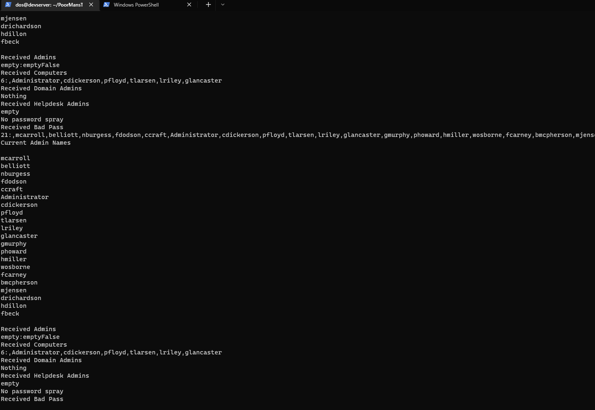
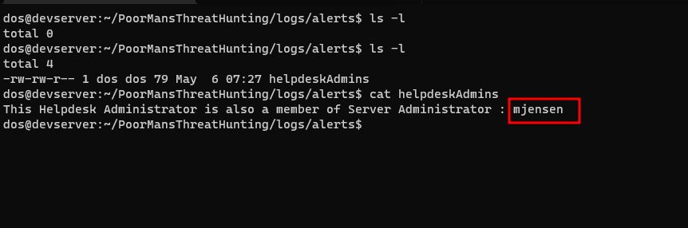

# Poor Man's Threat Hunting

## Overview

I created this project as a solution for the Auror Project Challenge - 2, by [Sudarshan Pisupati](https://www.linkedin.com/in/sudarshan-pisupati-607b0ab/). 

The challenge requires the following Active Directory environment setup :

**There will be 3 machines in this lab:**
-   1 Domain Controller
-   1 Server which is designated the “crown jewel” server
-   1 machine where you will test your solution designated as your own machine
    

**Create and distribute security groups and members**:

-   “Server Administrators” is local administrator on crown jewel server -  has 5 members
-   “Server Maintenance” has RDP rights - has 5 members. 2 members are also Server Administrators. 
-   “Helpdesk Admins” is local administrator on your own machine - has 5 members
-   “Domain Admins” has 5 members
-   “Exchange Admins” is a local administrator on the domain controller - has 5 members

**Attack surface detection use cases:**

-   Gather the count of administrators on the crown jewel machine and domain controller (including local accounts). Detect when this number changes. 
-   Detect when a computer account is added to any of the created domain security groups. 
-   Detect a change to the domain admins group membership and alert in slack
-   Detect when a helpdesk administrator is also a server administrator
-   Detect an attempt to spray passwords using user attributes
    
	
	**Test Cases:**

-   Add a local administrator account to the crown jewel machines
-   Create a group with 5 members and add it to the server administrators group
-   Add a computer account to the domain admins group
-   Add server administrator group membership to one of the members of the “helpdesk admins”
-   Password spray against all users using an automated tool
    


## Installation

### Compiling the LANALyser.exe binary

The `LANALyser` code is the one that we run on the "Own Machine" (Here it is `Client01`). You can use the Visual Studio project solution to open and build the project

Before compiling change the hardcoded IP address on the `Client.cs` code. (Will be changed later on)

### Working of the LANALyser code

- It monitors total numner of admins (including local admin)
- It monitors admin groups and checks if there is any changes to them
- It monitors if any computer account is added to any Security Group or not
- It monitors for password sprays by using the user attributes `badPwdCount` and `badPasswordTime`
- It does these things using LDAP queries (reason for being called LANALyser) and sends the results to the `server.py` code running on another linux server (or windows if required)
- It runs at an interval of 300 miliseconds gap between each function
- Can be run by user 

**NOTE: Detailed working description will be provided in my blog once I am satisfied with the working**


### About the server.py program

- The `server.py` program starts a TCP server and waits for connections from the `LANALyser.exe`
- It accepts all the inputs sent to it and has function which analyses the output 
- Then it will create alert files in the folder `logs/alerts` depending upon the type of alert that is generate (Slack integration will be done later)


## Usage:

- First place the compiled binary of `LANALyser.exe` on the machine that you Own (not the **Cown Jewel**)
- Then start the `server.py` code on linux server

```
python3 server.py
```


- Once the server has started, run the `LANALyser.exe` on the target machine
- As soon you start `LANALyser.exe` it will start sending all the information to the linux server


- The linux server will also receive those information




## Checking Use Cases:

### User added to a Domain Security Group

- First we add a different user to the `Exchange Admins` group


- After that if we check the `logs/alerts` folder there will be a new file called `adminDetails`
- This will have the name of all the admins that are currently there, including the new admin added


### Detect Change to Domain Admins Membership

- Add a user to the `Domain Admins` group 


- We will see that there will be a file `domainAdmins` in the `logs/alerts` folder
- Along with the file `adminDetails` as there is a change in the number of admins


### Detect when a Helpdesk Admin is also a Server Administrator

- Add the user a user from the `Helpdesk Admins` group to the `Server Administrators` group


- Here we will add the member `MOON JENSEN` from the `Helpdesk Admins` group to `Server Administrators` group


- We will find that there is a file `helpdeskAdmins` in the folder `logs/alerts`




### Detect an attempt to password spray

- Here the user attributes `badPwdCount` and `badPasswordTime` are used to determine whether there has been any attempt at password spraying or not

- Use the script [DomainPasswordSpray.ps1](https://github.com/dafthack/DomainPasswordSpray/blob/master/DomainPasswordSpray.ps1) to password spray against all the user accounts on the domain

- Login as the domain Administrator 


- Set the `Execution Policy` to `Unrestricted`


- Do turn off Windows Defender, if you're using any public script


- Now import the powershell module
- Execute the function `Invoke-DomainPassowrdSpray` with any password


- In the `logs/alerts` directory, you'll find a file with the details of the password spray
- It tells the number of accounts the password spray was performed against
- The `sAMAccountName` of the accounts as well

## Slack Alert Integration

- Now a slack alert will be generated for each of the use cases
- You need to add your own webhook to receive the notification on a particular channel
- Refer to [Sending Automated slack messages](https://medium.com/@sharan.aadarsh/sending-notification-to-slack-using-python-8b71d4f622f3#:~:text=Click%20on%20Apps%20%2B%20icon%20and,on%20create%20a%20new%20channel.)


## TODO:

1. ~~Implement Slack/Desktop notification for alerts~~
2. Improve the algorithm to detect password sprays, in order reduce the number of false positives
3. Improve sync between the server and client
4. Fix occasional crashes 
5. Detect local administrators by parsing the Group Policy
6. Prevent counting same admins again